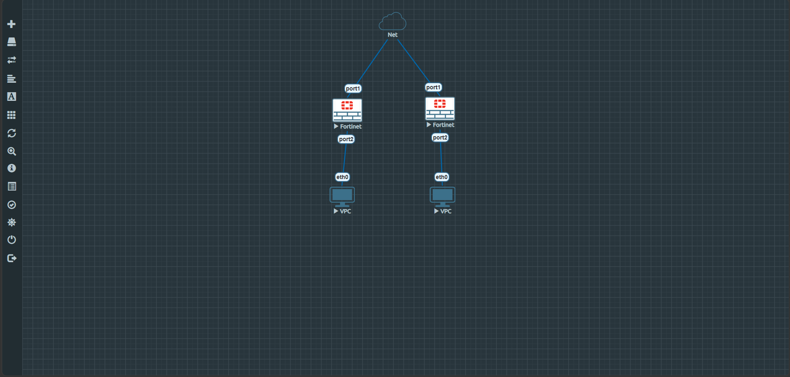

# Graduation Project – FortiOS 7.6 Administrator
**Creativa | June 26 – August 10, 2026**

## 1. Objective

For this project I built a small two-site network in EVE-NG using two FortiGate firewalls, and implemented all the core configuration areas we covered in the course: accounts, interfaces, firewall policy, routing, authentication, security profiles, and a Site-to-Site VPN between the two sites.

I've documented below exactly what I configured, the commands I used, and how I verified each part was actually working — including a VPN troubleshooting issue I ran into and how I diagnosed it (details in section 4.7).

## 2. Topology

```
VPC1 (192.168.10.10)
        |
      port2
   ┌─────────────┐        port1        port1        ┌─────────────┐
   │  FGT1-Site1 │ ─────────────────────────────────│  FGT2-Site2 │
   └─────────────┘   WAN link (100.64.0.0/24)        └─────────────┘
        |                                                    |
      port2                                                port2
        |                                                    |
   VPC1 subnet: 192.168.10.0/24                    VPC2 subnet: 192.168.20.0/24
                                                            |
                                                   VPC2 (192.168.20.10)
```

- Two FortiGate-VM64-KVM devices (FGT1-Site1 and FGT2-Site2)
- Connected via a WAN link (port1 on each device)
- Each FortiGate connects to a local LAN (port2) with one VPC acting as an end device
- A Site-to-Site IPsec VPN tunnel connects the two LANs across the WAN

**EVE-NG topology screenshot:**



## 3. IP Addressing

| Device | Interface | Role | IP Address |
|---|---|---|---|
| FGT1-Site1 | port1 | WAN | 100.64.0.1/24 |
| FGT1-Site1 | port2 | LAN | 192.168.10.1/24 |
| FGT1-Site1 | VPN_to_FGT2 | Tunnel Interface | — |
| FGT2-Site2 | port1 | WAN | 100.64.0.2/24 |
| FGT2-Site2 | port2 | LAN | 192.168.20.1/24 |
| FGT2-Site2 | VPN_to_FGT1 | Tunnel Interface | — |
| VPC1 | eth0 | End Device | 192.168.10.10/24, gw 192.168.10.1 |
| VPC2 | eth0 | End Device | 192.168.20.10/24, gw 192.168.20.1 |

## 4. Configuration Summary (7 Core Requirements)

Below is each requirement, what I actually typed in the CLI, and how I checked it worked.

### 4.1 Account Configuration
I created a restricted read-only admin account (`operator1` / `operator2`) on each device, on top of the default `admin` account, using a custom access profile that only has read rights.

```
config system accprofile
    edit "readonly_admin"
        set secfabgrp read
        set ftviewgrp read
        set authgrp read
        set sysgrp read
        set netgrp read
        set loggrp read
        set fwgrp read
        set vpngrp read
        set utmgrp read
    next
end

config system admin
    edit "operator1"
        set accprofile "readonly_admin"
        set vdom "root"
        set password Operator@123
    next
end
```

### 4.2 Interface Configuration
By default port1 comes up as DHCP, so I had to switch it to static mode before I could set the WAN IP. Both port1 (WAN) and port2 (LAN) were set to static IPs matching the addressing table above.

```
config system interface
    edit "port1"
        set mode static
        set ip 100.64.0.1 255.255.255.0
        set allowaccess ping
    next
    edit "port2"
        set mode static
        set ip 192.168.10.1 255.255.255.0
        set allowaccess ping https ssh
    next
end
```

### 4.3 Firewall Policy
I set up three policies on each FortiGate:
1. **LAN → Internet** – NAT enabled, tied to the security profiles and the user group for authentication
2. **LAN1 → LAN2 via VPN** – no NAT, traffic routed out through the VPN tunnel interface
3. **LAN2 → LAN1 via VPN** – the return-direction policy for the same traffic

```
config firewall policy
    edit 1
        set name "LAN1_to_Internet"
        set srcintf "port2"
        set dstintf "port1"
        set action accept
        set srcaddr "LAN1_subnet"
        set dstaddr "all"
        set nat enable
        set groups "employees_grp"
        set utm-status enable
        set av-profile "default"
        set webfilter-profile "default"
        set ssl-ssh-profile "certificate-inspection"
    next
    edit 2
        set name "LAN1_to_LAN2_via_VPN"
        set srcintf "port2"
        set dstintf "VPN_to_FGT2"
        set action accept
        set srcaddr "LAN1_subnet"
        set dstaddr "LAN2_subnet"
        set nat disable
    next
    edit 3
        set name "LAN2_to_LAN1_via_VPN"
        set srcintf "VPN_to_FGT2"
        set dstintf "port2"
        set action accept
        set srcaddr "LAN2_subnet"
        set dstaddr "LAN1_subnet"
        set nat disable
    next
end
```

### 4.4 Routing
Since I used a route-based VPN, I added a static route on each FortiGate pointing the remote LAN subnet at the tunnel interface directly (not at a gateway IP) — that's what makes traffic to the other site actually go through the tunnel instead of trying to go out the WAN normally.

```
config router static
    edit 1
        set dst 192.168.20.0 255.255.255.0
        set device "VPN_to_FGT2"
    next
end
```

### 4.5 Authentication
I created a local user and put them in a group (`employees_grp`), then attached that group to the Internet-access policy so users have to authenticate before they get outbound access.

```
config user local
    edit "user1"
        set type password
        set passwd User@12345
    next
end

config user group
    edit "employees_grp"
        set member "user1"
    next
end
```

### 4.6 Security Profiles
On the Internet-access policy I enabled two profiles as required:
- **Antivirus** (`default`, flow-based)
- **Web Filter** (`default`)

I also added the `certificate-inspection` SSL/SSH profile so HTTPS traffic gets at least handshake-level inspection.

```
config firewall policy
    edit 1
        set utm-status enable
        set av-profile "default"
        set webfilter-profile "default"
        set ssl-ssh-profile "certificate-inspection"
    next
end
```

### 4.7 VPN – Site-to-Site IPsec

I set up a route-based IPsec VPN between FGT1-Site1 and FGT2-Site2 over the WAN link, so traffic between the two LANs travels through an encrypted tunnel instead of in the clear.

```
config vpn ipsec phase1-interface
    edit "VPN_to_FGT2"
        set interface "port1"
        set peertype any
        set net-device disable
        set remote-gw 100.64.0.2
        set psksecret ********
    next
end

config vpn ipsec phase2-interface
    edit "VPN_to_FGT2_p2"
        set phase1name "VPN_to_FGT2"
        set src-subnet 192.168.10.0 255.255.255.0
        set dst-subnet 192.168.20.0 255.255.255.0
    next
end
```

**How I verified it:**
```
diagnose vpn ike gateway list
```
```
IKE SA:   created 1/1  established 1/1
IPsec SA: created 1/1  established 1/1
```
Phase 1 (IKE) and Phase 2 (IPsec SA) both came up established on both sides, and the SPIs matched correctly in both directions (FGT1's `enc` SPI = FGT2's `dec` SPI and vice versa) — which confirms the negotiation genuinely completed and both firewalls agree on the same tunnel parameters.

**The troubleshooting part:** when I first tested this with a ping between the two VPCs, it wasn't going through, even though the tunnel showed as established. I went through this step by step instead of just guessing:

1. `diagnose debug flow` on FGT1 while pinging — showed the packet arriving from port2, a route lookup correctly pointing it at the VPN interface, but then nothing further (no encrypt step, no reply).
2. `diagnose sys session list` — no session for the ICMP traffic was staying open, which meant it was being dropped right after the routing decision.
3. I double-checked the actual config wasn't the problem: interfaces, static routes, firewall policies (both directions), and address objects were all correct — confirmed with `show firewall policy` / `show firewall address`.
4. I disabled NPU/ASIC offload on the VPN and policies in case it was a virtualization quirk, and rebooted both FortiGates for a clean state — the IKE/IPsec SAs still came up fine afterward, but the data plane still wasn't passing packets.
5. `get system status` showed `License Status: Invalid` on both VMs. That's the actual cause: an unlicensed FortiGate-VM evaluation image will complete IKE/IPsec negotiation (control plane) but restricts IPsec packet encryption/decryption (data plane) — which matches exactly what I was seeing (`dec:pkts/enc:pkts` staying at 0 even with a fully established tunnel).

So the VPN is configured correctly and the negotiation is provably successful — the only thing not working end-to-end is a licensing restriction of the lab environment itself, not a mistake in the setup.

## 5. Testing & Verification Commands

| Purpose | Command |
|---|---|
| Interface status | `show system interface` |
| Admin accounts | `show system admin` |
| Firewall policies | `show firewall policy` |
| Static routes | `show router static` |
| Local users / groups | `show user local` / `show user group` |
| IKE gateway status | `diagnose vpn ike gateway list` |
| IPsec tunnel status | `diagnose vpn tunnel list` |

## 6. Tools Used
- EVE-NG (network emulation)
- FortiGate-VM64-KVM v7.2.4 (build 1396, GA)

## 7. Team
*(add team member names here)*

## 8. Notes
This README reflects what I actually configured and tested in the lab — the commands, outputs, and the VPN troubleshooting steps are all from real CLI sessions on the two FortiGates, not just a theoretical writeup.

LinkedIn post: https://www.linkedin.com/posts/mahmoud-khamis-00087031b_fortinet-fortigate-networksecurity-share-7487670130877894656-pKK3

## 9. Deadline
Discussion date: **28-Jul-2026**
